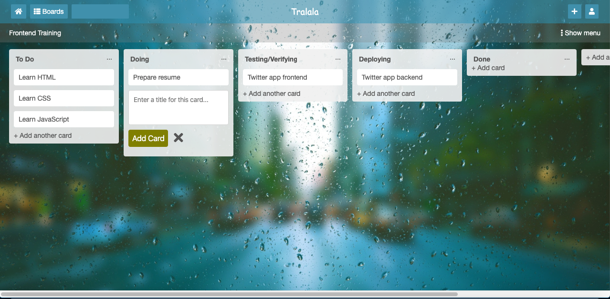
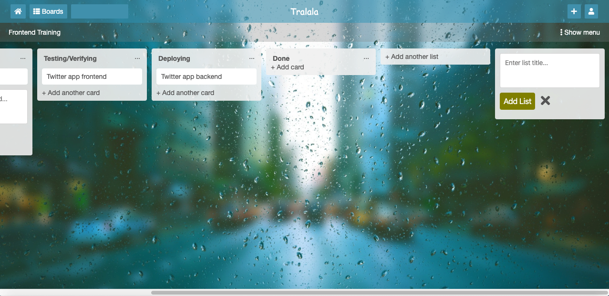

# TrelloDashboard
A sample Trello dashboard using HTML5 and CSS3. 

Submitted as a part of the final assessment for the course Introduction to Full Stack Development offered by [GreatLearning.com](https://olympus.greatlearning.in/courses/11263). The task assigned was to build a Trello-like app which should be horizontally scrollable. Screenshots are given below for reference.

### Dashboard

### Dashboard when scrolled

